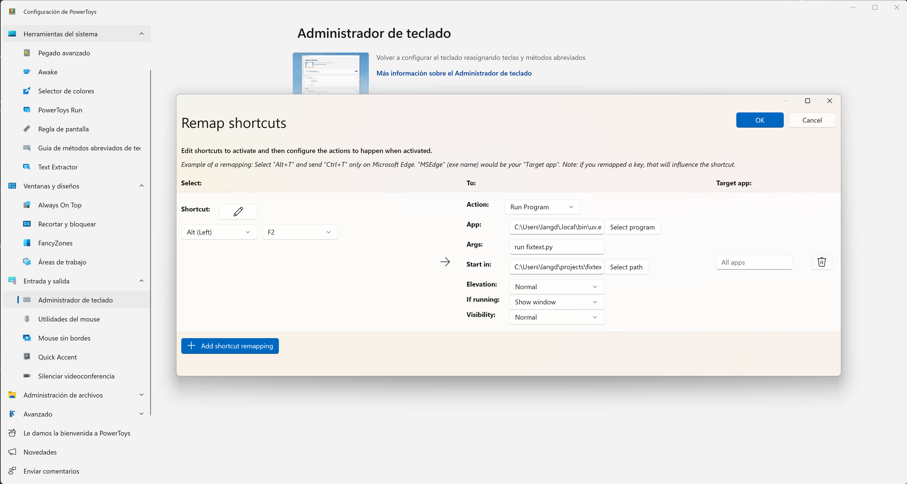

# FixText

A simple Python utility to modify clipboard text using AI text transformations.

## Description

FixText is a command-line tool that takes text from your clipboard, transforms it according to selected style options, and places the modified text back in your clipboard.

## Features

- **Four text transformation styles:**
  1. Formal - Clean, well-written, and formal language
  2. Cult - Elevated, sophisticated language with complex vocabulary
  3. Valle Inclán - Mimics the style of Spanish writer Valle Inclán
  4. Non Sense - Creates playful, illogical word combinations

## Requirements

- uv
- A free tier GEMINI API KEY [from Google AI Studio](https://aistudio.google.com/apikey) inside `.env` file. `GEMINI_API_KEY=...`

## Usage

1. Copy text to your clipboard
2. Run the script: `uv run fixtext.py`
3. Select a formatting option
4. The transformed text will be placed in your clipboard, ready to paste

## Keyboard Shortcut (Optional)

You can set up a keyboard shortcut using tools like PowerToys to quickly access FixText.
