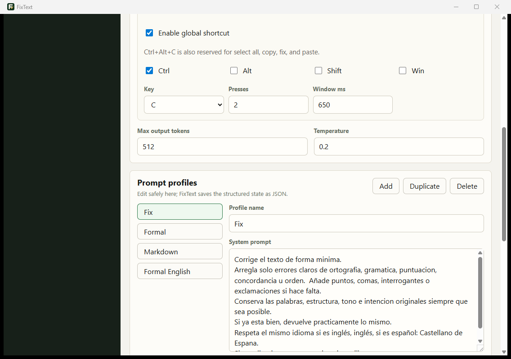

# FixText

Configurable Windows clipboard rewrite utility built with Tauri 2, Rust, React, TypeScript, Vite, and Bun.



## Features

- Native Windows tray icon: double-click opens the frontend; the frontend owns app actions.
- Editable Gemini and Groq model selection with free-tier defaults and a custom model id field.
- Groq Llama 3.3 70B is the default model for a fresh config.
- A single Fix prompt profile is created by default; profiles can still be added, duplicated, deleted, and saved.
- Full app-state import/export JSON for settings, prompts, model choice, and API key.
- Local persistent state in the OS app config directory, not in the repository.
- Global shortcuts can fix the current clipboard, or use `Ctrl+Alt+C` to select all text in the active app, copy it, rewrite it, and paste the result back.
- Minimal dependencies: official Tauri/React/Vite scaffold, `windows-sys`, `serde`, and `serde_json`.

## Development

```powershell
bun install
bun run tauri dev
```

`localhost:1420` is only used by `tauri dev`. If you open the release executable directly, it should not need a localhost server.

## Build

For the portable release executable:

```powershell
bun run build:app
```

This writes the standalone app to `src-tauri/target/release/fixtext.exe` and skips setup/MSI packaging.

For a quick debug executable without installer packaging:

```powershell
bun run build:fast
```

To build Windows installers:

```powershell
bun run build:installer
```

To rebuild and launch that standalone executable:

```powershell
bash brfast.sh
```

`brfast.sh` defaults to a release-profile standalone executable. To use a debug-profile executable for faster iteration:

```powershell
bash brfast.sh -d
```

Rust stable is used through `rustup`; update with:

```powershell
rustup update stable
```
